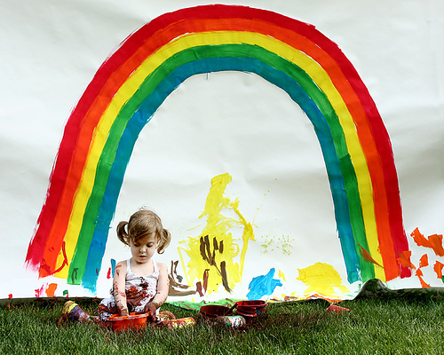

# Generation: Image Caption

This project presents a multimodal pipeline that generates image captions by leveraging contrastive pre-training and fine-tuning on the Flickr8k dataset.

## Table of Contents
- [Introduction](#introduction)
- [Data](#data)
- [Methods](#methods)
- [Results](#results)
  - [Evaluation Metrics](#evaluation-metrics)
  - [Example Inference Results](#example-inference-results)
- [Directory Structure](#directory-structure)
- [Installation](#installation)
  - [Conda Environment Setup](#conda-environment-setup)
  - [Docker Setup (Optional)](#docker-setup-optional)
- [Usage](#usage)
  - [Run Main Script](#run-main-script)
  - [Run Each Source Script (Optional)](#run-each-source-script-optional)
    - [Data Preparation](#data-preparation)
    - [Training](#training)
    - [Evaluation](#evaluation)
    - [Inference](#inference)

## Introduction

This application fine-tunes OpenAI's Contrastive Language-Image Pre-Training (CLIP) model (clip-vit-base-patch32) for image-to-text captioning. It trains on the Flickr8k dataset by aligning paired image-caption samples through multimodal contrastive learning. The trained model can retrieve the most semantically relevant captions given an input image.

## Data

The dataset used is the Flickr8k image captioning dataset. Each image is associated with five human-written English captions. The dataset is split into training and test subsets, each preprocessed into separate directories with caption files and images.

The dataset was created by Micah Hodosh and Peter Young, and Julia Hockenmaier and is under a CC0: Public Domain License. For more information, visit [Flickr 8k Dataset on Kaggle](https://www.kaggle.com/datasets/adityajn105/flickr8k).

> Hodosh, M., Young, P., & Hockenmaier, J. (2013). Framing image description as a ranking task: Data, models and evaluation metrics, Journal of Artificial Intelligence Research, 47, 853–899. [Paper link](https://dl.acm.org/doi/10.5555/2566972.2566993)

## Methods

The application uses the following methods:
- **Model**: OpenAI CLIP.
- **Training Strategy**: Contrastive loss between image and text embeddings.
- **Preprocessing**: One caption per image sampled for training, which can be adjusted.
- **Loss**: Symmetric cross-entropy loss over image-text similarity matrix.


*Figure from [CLIP: Connecting Text and Images by Alec Radford, Ilya Sutskever, Jong Wook Kim, Gretchen Krueger, and Sandhini Agarwal](https://openai.com/index/clip).*

> Radford, A., Kim, J. W., Hallacy, C., Ramesh, A., Goh, G., Agarwal, S., Sastry, G., Askell, A., Mishkin, P., Clark, J., Krueger, G., & Sutskever, I. (2021). Learning Transferable Visual Models From Natural Language Supervision. ICML. [Paper link](https://arxiv.org/abs/2103.00020)

## Results

The model is evaluated on the test set using the Top-1 accuracy. Each test image is compared against all test captions, and the model's top-matching caption is checked for correctness.

### Evaluation Metrics
- **Top-1 Accuracy**: 0.1506

The top-1 accuracy measures if the highest-scoring caption is the true one for each image.

### Example Inference Results
Here are example results from the trained model:


Image: 1007129816_e794419615.jpg
True Caption: A man in an orange hat starring at something .
Top-5 Predicted Captions:
  - A man with glasses is wearing a beer can crocheted hat .
  - A man wears an orange hat and glasses .
  - A man with glasses is wearing a beer can crocheted hat .
  - A man wears an orange hat and glasses .
  - A man wears an orange hat and glasses .



Image: 1002674143_1b742ab4b8.jpg  
True Caption: A small girl in the grass plays with fingerpaints in front of a white canvas with a rainbow on it .
Top-5 Predicted Captions:
  - A small girl in the grass plays with fingerpaints in front of a white canvas with a rainbow on it .
  - A girl paints in front of a rainbow backdrop .
  - A child sits before a rainbow painting .
  - A little girl in pigtails is painting a rainbow .
  - A girl paints a rainbow outdoors .

See full results in `results/inference_results.txt`.

## Directory Structure

```
generation-image-caption/
├── 1002674143_1b742ab4b8.jpg     # Example Image B
├── 1007129816_e794419615.jpg     # Example Image A
├── data/                         # Dataset
├── clip.png                      # Illustration of OpenAI CLIP
├── Dockerfile                    # Docker setup
├── environment.yml               # Conda environment setup
├── LICENSE                       # Project license
├── main.py                       # Main pipeline script
├── README.md                     # Project README
├── requirements.txt              # Python dependencies
├── results/                      # Outputs from inference and evaluation
│   ├── evaluation_metrics.txt    # Evaluation metrics summary
│   └── inference_results.txt     # Randomly-selected inference results
└── src/                          # Source code
    ├── data.py                   # Data preparation script
    ├── eval.py                   # Evaluation script
    ├── infer.py                  # Inference script
    └── train.py                  # Training script
```

## Installation

### Conda Environment Setup

1. Clone the repository:
   ```bash
   git clone https://github.com/your-ai-solution/generation-image-caption.git
   cd generation-image-caption
   ```

2. Create a Conda environment:
   ```bash
   conda env create -f environment.yml
   conda activate generation-image-caption
   ```

3. Install dependencies:
   ```bash
   pip install -r requirements.txt
   ```

### Docker Setup (Optional)

1. Build the Docker image:
   ```bash
   docker build -t generation-image-caption .
   ```

2. Run the Docker container:
   ```bash
   docker run --gpus all -v $(pwd)/data:/app/data -v $(pwd)/results:/app/results generation-image-caption
   ```

##  Usage

### Run Main Script

Run the main script that automates the entire pipeline:
   ```bash
   python main.py
   ```

### Run Each Source Script (Optional)

1. Data preparation: Download and preprocess the dataset.
   ```bash
   python src/data.py
   ```

2. Training: Train a CLIP model.
   ```bash
   python src/train.py
   ```

3. Evaluation: Evaluate the CLIP model.
   ```bash
   python src/eval.py
   ```

4. Inference: Run inference on random test images.
   ```bash
   python src/infer.py
   ```